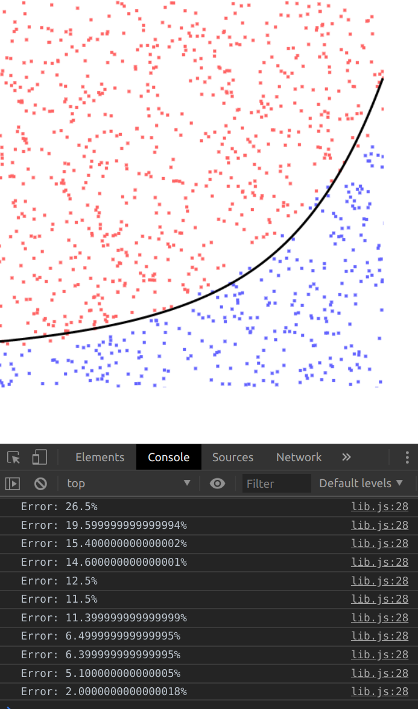

## This is an attempt to implement a simple "linear model" in JavaScript. (I guess, this rather is a genetic algorithm)

### What I am trying to achieve:
I want to create a program, which I feed in some training data, which is comprised of two values. There is a certain line, above, or below which a point will either be classified as type "A" or "B". The program's job is to figure out, WHERE TO DRAW THE LINE.

### How to define the line:
The line is defined by a linear function: 
`f(x) = k  x + d` 
"k" and "d" are our weights. This means, our program needs to figure out these two values.

### How does the program figure out the values?
At first, both weights will have some initial value, lets say 0. After that, we calculate the error of the the model. The values are tweaked by some random amounts and the error is calculated again. If the error is lower, we keep the changes otherwise we discard it. This is done multiple times until the error reaches a local minimum.

### About the dataset:
The dataset consists of points (x;y) and a label the label is either "0" or "1" depending on if the point is above or below a linear function.
> (`data/` contains a dataset-generator, which can be run using `npm run generate`, the generator-configuration is in `data/generate.js`)

### Example
The color of the dots indicates their label (red = 1; blue = 0) and their position is defined by well .. their position (lower-left corner is (0;0)).

The black line is the function, which the algorithm figured out.

The error-count in the console shows how many percent (scale = 0-1) of the points were predicted invalidly.

